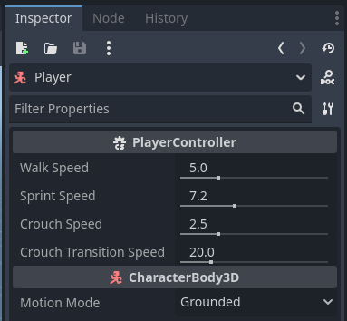
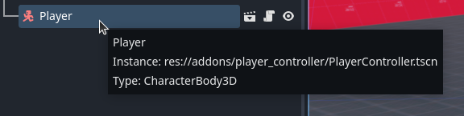
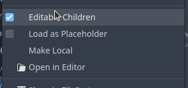
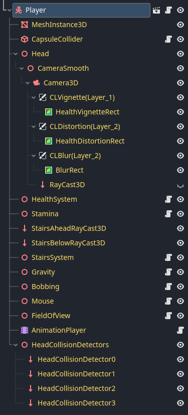

# Edit Parameters and Children

By selecting the Player node in the Scene pane, you can view its 4 movement related parameters in the inspector. 

There are many more parameters that can be accessed to alter the behavior of all the systems contained in PlayerController. In order to do this, right click the Player node in the Scene pane

Then tick on **Editable Children** in the menu that appears.

A list of all of Player's children will appear in yellow to indicate edits to these node parameters will only take effect and be saved in the current scene they are present in, and should you untick **Editable Children** those edits will be lost.

Proceed to the next section for a more permanent method modifying the PlayerController scene for your needs. 

