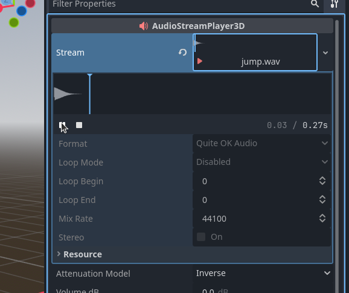

# Tutorial 3.0 - Extend PlayerController for your own Game

This tutorial will walk your through extending **PlayerController.tscn** for your own needs in such a way that your newly extended version can easily be dragged and dropped into any number of game worlds without additional effort. 

Begin by navigating to the **PlayerController.tscn** file in the FileSystem pane. You will find it under addons/player_controller. Right click the file and select "New Inherited Scene". 

The editor will now open into a 3D scene that contains only the Player node as the root and all of it's editable children in yellow. 

In this scene you can modify any parameters of Player or its children as needed or even disable features by detaching scripts from Yellow nodes and/or making them invisible as needed. You can also add on your own features by adding Nodes of your own that may run scripts of your own creation at any place in the Player hierarchy you may need.

## Tutorial 3.1 - Utilizing PlayerController Signal API

Lets demonstrate how you can make the **PlayerController.tscn** scene your own by using the Signal API to add a jump sound effect. 

Select the Player root node at the top of the Scene pane, then click the big plus-sign to open the Create New Node window.

Double click the AudioStreamPlayer3D node to add it as a child of Player. 

With the AudioStreamPlayer3D node selected in the Scene pane, drag-and-drop your jump audio file (in our case jump.wav) from the FileSystem pane to the Stream export in the Inspector for the AudioStreamPlayer3D.

Click the Stream export and then the player button to make sure the jump sounds alright in the engine. 

Now click the tab to the right of "Inspector" to bring up the Node pane, and again select the Player node in the Scene pane on the other side of the editor. You will now see a list of all Signals that may be emitted by the Player node, including the two defined in the PlayerController.cs script: HeadHitCeiling and Jumped.

Right click the Jumped signal and click "Connect".

A window will pop-up to select the method we want to be called when the player node emits the Jumped signal. Scroll down to the AudioStreamPlayer3D that we just added as a child of Player, select it, then click "Pick" (there is no need to modify the string to the right of the Pick button).

The resulting additional pop-up will show all methods in AudioStreamPlayer3D this signal may be connected to. We want to connect it to the play method, so that the sound effect will play each time the player jumps. Double click the play method to select it. 

The popup will close and the text to the left of the "Pick" button should say "play". Click the "Connect" button to finalize the signal-to-method connection.  

In the Node pane that signal will now indicate what method of which node it is connected to.

Save this inherited scene with its own unique name. We have now successfully given our player's jump a sound effect! To try it out add the inherited scene to your game world following the steps in **Tutorial 1.0**, then play the world scene.  

To see more examples of using the Signal API, you can open the **PlayerControllerWithSfx.tscn** in the editor, which connects the rest of the signal API to different sound effects.
