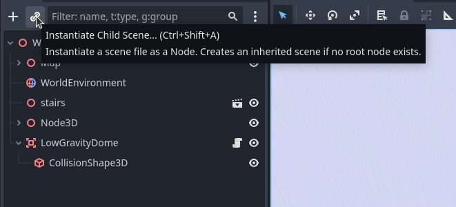
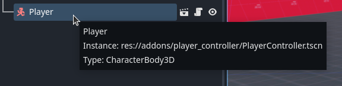
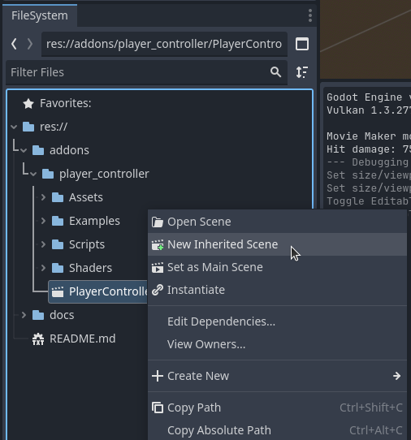
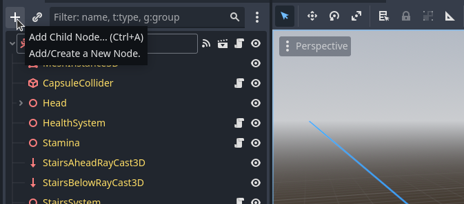

# Tutorial 1.0 - Add PlayerController to your Game World

After installing the addon from the AssetLib, a PlayerController node can be added into your scene using the Scene pane. PlayerController is implemented as a scene hierarchy, which means it must be instantiated in your game world as a child scene. Click the chain link icon at the top of the Scene pane in Godot.

This will bring up a window that may be blank or may contain some of your already saved scenes. In the bottom right of the window, make sure to toggle on the Addons switch. You can now find PlayerController.tscn in the list or search for it.

Select **PlayerController.tscn**.

The default capsule mesh of the PlayerController scene will have been added to the scene. It's name in the node hierarchy is simply "Player". It may not be placed in the scene in an ideal location, so be sure to adjust it's transform until the capsule shape is not obscured by any other collision geometry. 

For PlayerController to work properly, make sure that some collision geometry is present in your world and is on Collision Layer 1 (in the next section you will see how this parameter can be adjusted). 

You can now try out PlayerController in your game world.

# Tutorial 2.0 - Edit PlayerController's Parameters and Children

By selecting the Player node in the Scene pane, you can view its 4 movement related parameters in the inspector. 

There are many more parameters that can be accessed to alter the behavior of all the systems contained in PlayerController. In order to do this, right click the Player node in the Scene pane

Then tick on **Editable Children** in the menu that appears.

A list of all of Player's children will appear in yellow to indicate edits to these node parameters will only take effect and be saved in the current scene they are present in, and should you untick **Editable Children** those edits will be lost.

Proceed to the next section for a more permanent method modifying the PlayerController scene for your needs. 

# Tutorial 3.0 - Extend PlayerController for your own Game

This tutorial will walk your through extending PlayerController.tscn for your own needs in such a way that your newly extended version can easily be dragged and dropped into any number of game worlds without additional effort. 

Begin by navigating to the PlayerController.tscn file in the FileSystem pane. You will find it under addons/player_controller. Right click the file and select "New Inherited Scene". 

The editor will now open into a 3D scene that contains only the Player node as the root and all of it's editable children in yellow. 

In this scene you can modify any parameters of Player or its children as needed or even disable features by detaching scripts from Yellow nodes and/or making them invisible as needed. You can also add on your own features by adding Nodes of your own that may run scripts of your own creation at any place in the Player hierarchy you may need.

## Tutorial 3.1 - Utilizing PlayerController Signal API

Lets demonstrate how you can make the **PlayerController.tscn** scene your own by adding a simple script that plays a jump noise whenever the player jumps. 

Select the Player root node at the top of the Scene pane, then click the big plus-sign to open the Create New Node window.

With the AudioStreamPlayer3D node selected in the Scene pane, drag-and-drop your jump audio file (in our case jump.wav) from the FileSystem pane to the Stream export in the Inspector for the AudioStreamPlayer3D.

Click the Steam export and then the player button to make sure your jump sound sounds alright in the engine. 

