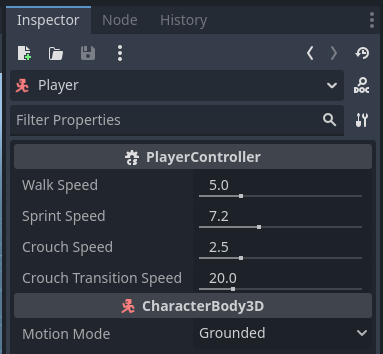
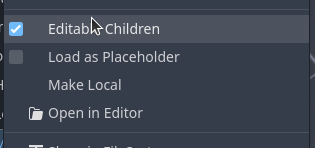
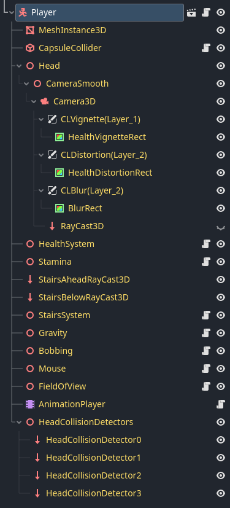

# Add PlayerController to your Scene

After installing the addon from the AssetLib, a PlayerController CharacterBody3D can be added into your scene using the Scene pane. PlayerController is implemented as a scene hierarchy, which means it must be instantiated in your game world as a child scene. Click the chain link icon at the top of the Scene pane in Godot.

This will bring up a window that may be blank or may contain some of your already saved scenes. In the bottom right of the window, make sure to toggle on the Addons switch. You can now find PlayerController.tscn in the list or search for it.

Select **PlayerController.tscn**.

The default capsule mesh of the PlayerController scene will have been added to the scene. It's name in the node hierarchy is simply "Player". It may not be placed in the scene in an ideal location, so be sure to adjust it's transform until the capsule shape is not obscured by any other collision geometry. 

For PlayerController to work properly, make sure that some collision geometry is present in your world and is on Collision Layer 1 (in the next section you will see how this parameter can be adjusted). 

You can now try out PlayerController in your game world.

# Editing PlayerController's Parameters and Children

By selecting the Player node in the Scene pane, you can view its 4 movements related parameters in the inspector. 

There are many more parameters that can be accessed to alter the behavior of all the systems contained in PlayerController. In order to do this, right click the Player node in the Scene pane

Then tick on **Editable Children** in the menu that appears.

A list of all of Player's children will appear in yellow to indicate edits to these node parameters will only take effect in the scene they are present in, and should you untick **Editable Children** those edits will be lost.

Proceed to the next section for a more permanent method modifying the PlayerController scene for your needs. 
